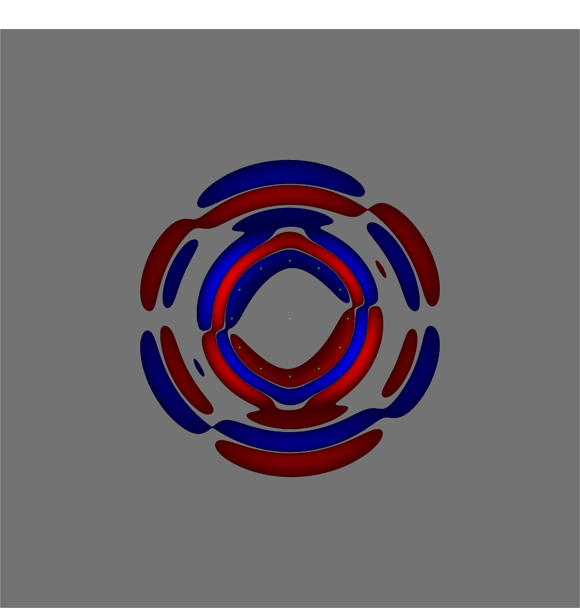
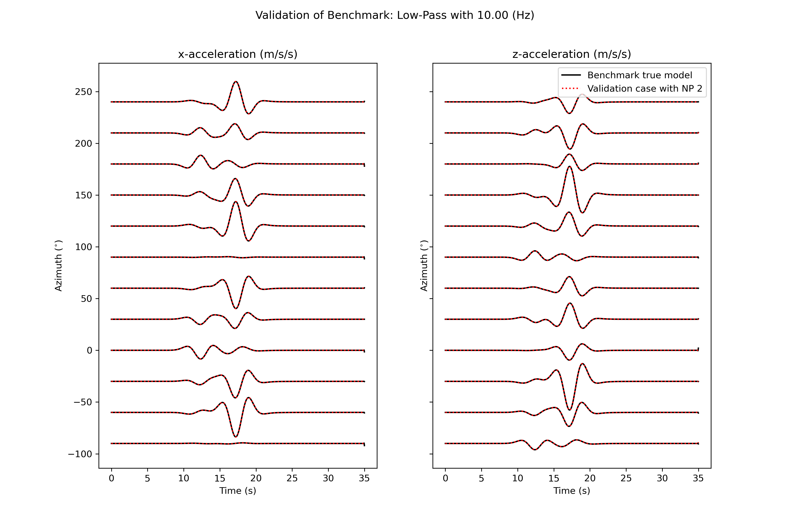
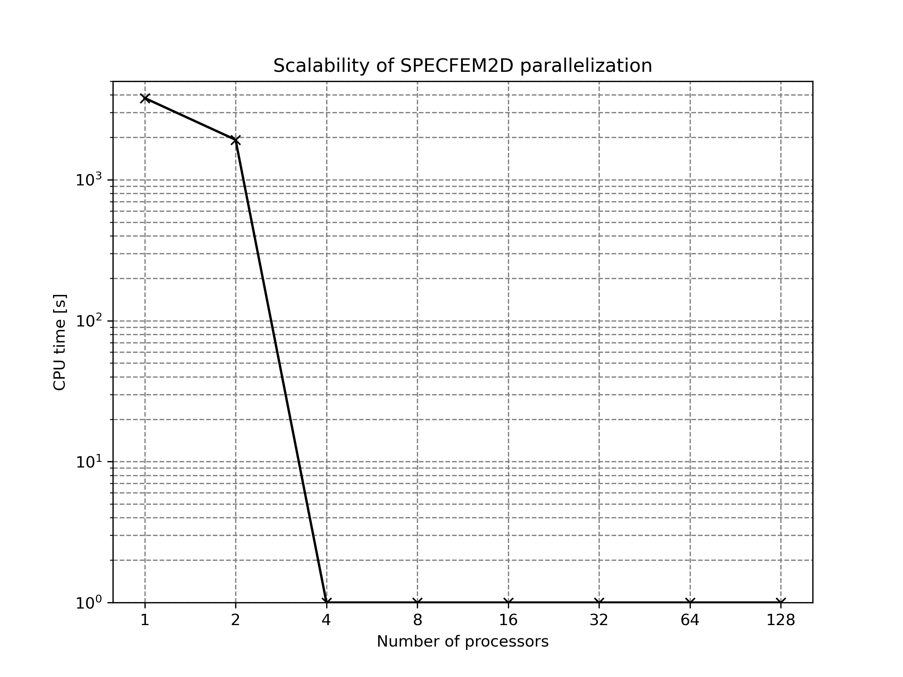

# Note of installation and scaling test using SPECFEM2D
---

## Installation
Following SPECFEM2D manual "Chapter 2"

1. Download SPECFEM2d with `git clone https://github.com/geodynamics/specfem2d.git`.
2. Go to `specfem2d` directory and type `./configure FC=gfortran CC=gcc MPIFC=mpif90 --with-mpi`. If using ifort, specify with `./configure FC=ifort MPIFC=mpif90 --with-mpi`. \
__NOTE__: If an error occurs, check `FLAGS_CHECK` in `Makefile` after `./configure ...`.\
It worked without any error with macOS Catalina 10.15.7; GNU Fortran (GCC) 8.2.0; Apple clang version 12.0.0 (clang-1200.0.32.2); MPICH Version: 3.2.1

## Simulation model setup
- 200km * 200km 2D full space P-SV elastic wave propagation.
- Total NSTEP = 5000, timestep = 7.0e-3 [s].
- Number of control nodes per element = 4
- Grid size = 250m
- Number of element = 640000
- Total number of grid point = 10250000
- PML absorbed boundary condition.
- Point source at the center of medium

## How to run the simulation

1. Copy the example project `Benchmark_fullspace` into `specfem2d/EXAMPLES/`. You can remove the other examples, but please put it into `EXAMPLE` as the script uses relative paths.

2. Go to `specfem2d/EXAMPLES/Benchmark_fullspace/` and set number of processors in `DATA/Par_file`, line 20: `NPROC=1`.

3. Run `sh run_benchmark.sh`.\
This shell script conducts the meshing and then computes wave propagation.

4. To plot waveform to validate your calculation, go to `specfem2d/EXAMPLES/Benchmark_fullspace/plot_result` and run `python validate_waveform.py 1`, where the number indicates the number of processors used like `OUTPUT_FILE_NP1`.\
NOTE: You need the following python modules: numpy (1.19.1); pandas (1.1.3);scipy (1.5.2). Versions are not strict, but please check it if your module is too old.

5. `specfem2d/EXAMPLES/Benchmark_fullspace/plot_result/plot_cputime.py` is a script to plot scalability of parallelization. Please note the number of cores and associated cputime from output (stdout), and add it into the script. You can plot with `python plot_cputime.py`

## Scaling of parallelization

